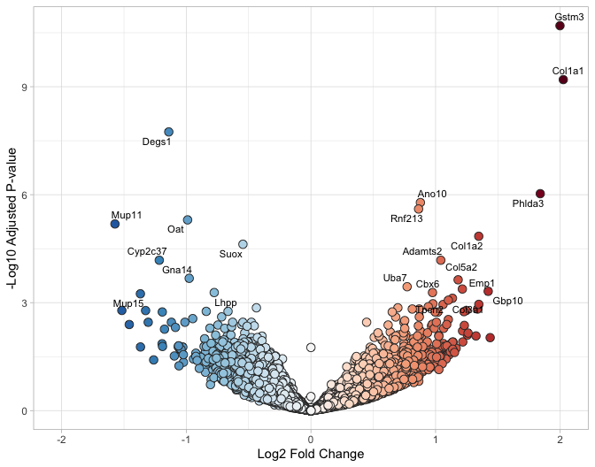
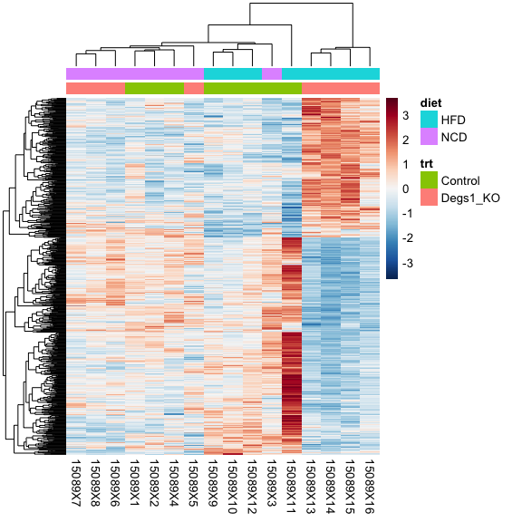
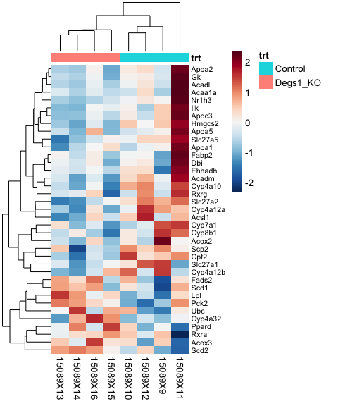
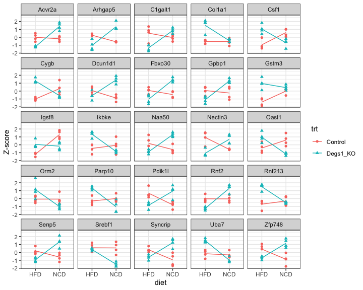
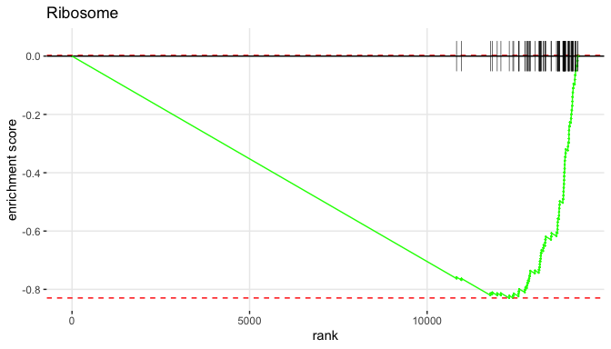

DESeq analysis of mouse liver samples
================
February 17, 2021

This guide follows the [Bioconductor RNA-Seq
workflow](http://master.bioconductor.org/packages/release/workflows/vignettes/rnaseqGene/inst/doc/rnaseqGene.html)
to find differentially expressed genes in
[GSE132056](https://www.ncbi.nlm.nih.gov/geo/query/acc.cgi?acc=GSE132056)
using
[DESeq2](http://www.bioconductor.org/packages/release/bioc/html/DESeq2.html)
version 1.30.0. For more details about the statistics, check the
original
[paper](https://genomebiology.biomedcentral.com/articles/10.1186/s13059-014-0550-8)
or online tutorials like the one from
[Harvard](https://hbctraining.github.io/DGE_workshop/lessons/04_DGE_DESeq2_analysis.html).

### Load samples and counts

Load the sample table with treatment and diet in the `extdata`
directory.

``` r
library(tidyverse)
extdata <- system.file("extdata", package="hciR")
samples <- read_tsv(paste(extdata, "liver_samples.tsv", sep="/"))
samples
#  # A tibble: 16 x 4
#     id       name      trt      diet 
#     <chr>    <chr>     <chr>    <chr>
#   1 15089X1  194-Liver Control  NCD  
#   2 15089X2  198-Liver Control  NCD  
#   3 15089X3  209-Liver Control  NCD  
#   4 15089X4  220-Liver Control  NCD  
#   5 15089X5  179-Liver Degs1_KO NCD  
#   6 15089X6  185-Liver Degs1_KO NCD  
#   7 15089X7  186-Liver Degs1_KO NCD  
#   8 15089X8  187-Liver Degs1_KO NCD  
#   9 15089X9  61-Liver  Control  HFD  
#  10 15089X10 70-Liver  Control  HFD  
#  11 15089X11 71-Liver  Control  HFD  
#  12 15089X12 76-Liver  Control  HFD  
#  13 15089X13 82-Liver  Degs1_KO HFD  
#  14 15089X14 89-Liver  Degs1_KO HFD  
#  15 15089X15 90-Liver  Degs1_KO HFD  
#  16 15089X16 92-Liver  Degs1_KO HFD
```

Load the combined
[featureCounts](http://bioinf.wehi.edu.au/featureCounts/) matrix.

``` r
counts <- read_tsv(paste(extdata, "liver_counts.tsv", sep="/"))
counts[, 1:8]
#  # A tibble: 53,801 x 8
#     geneid             `15089X1` `15089X2` `15089X3` `15089X4` `15089X5` `15089X6` `15089X7`
#     <chr>                  <dbl>     <dbl>     <dbl>     <dbl>     <dbl>     <dbl>     <dbl>
#   1 ENSMUSG00000000001      1941      1745      2768      2910      1124      2577      2265
#   2 ENSMUSG00000000003         0         0         0         0         0         0         1
#   3 ENSMUSG00000000028        21        23        27        27        14        28        17
#   4 ENSMUSG00000000031         3         3         1         5         3         3        10
#   5 ENSMUSG00000000037         0         0         0         0         0         0         4
#   6 ENSMUSG00000000049     28341     30970     50511     49518     22421     33501     31659
#   7 ENSMUSG00000000056       748       728      1665      1570       716      1002       694
#   8 ENSMUSG00000000058        53        84        94        75        28       110       121
#   9 ENSMUSG00000000078       249       187       200       355       149       180       221
#  10 ENSMUSG00000000085       102        84        93       121        89        77        90
#  # … with 53,791 more rows
```

Remove 17597 features with zero counts and 16431 features with 5 or
fewer reads in every sample to create a final count matrix with 19773
rows.

``` r
library(hciR)
counts <- filter_counts(counts, n=5)
#  Removed 17597 features with 0 reads
#  Removed 16431 features with <=5 maximum reads
```

Load the mouse annotations from Ensembl 92 in
[hciRdata](https://github.com/HuntsmanCancerInstitute/hciRdata) and
check genes with the highest number of assigned reads.

``` r
library(hciRdata)
n1 <- rowMeans(as_matrix(counts))
inner_join( dplyr::select(mouse92, 1:4,8),
 tibble(id= names(n1), mean_count = n1)) %>%
 mutate(description=trimws(substr(description, 1, 40))) %>%
 arrange(desc(mean_count))
#  Joining, by = "id"
#  # A tibble: 19,773 x 6
#     id                 gene_name biotype        chromosome description                              mean_count
#     <chr>              <chr>     <chr>          <chr>      <chr>                                         <dbl>
#   1 ENSMUSG00000029368 Alb       protein_coding 5          Serum albumin                              1179072.
#   2 ENSMUSG00000064339 mt-Rnr2   Mt_rRNA        MT         mitochondrially encoded 16S rRNA            445705.
#   3 ENSMUSG00000020609 Apob      protein_coding 12         Apolipoprotein B-100 Apolipoprotein B-48    363466.
#   4 ENSMUSG00000002985 Apoe      protein_coding 7          Apolipoprotein E                            277628.
#   5 ENSMUSG00000058207 Serpina3k protein_coding 12         serine (or cysteine) peptidase inhibitor    198378.
#   6 ENSMUSG00000064351 mt-Co1    protein_coding MT         mitochondrially encoded cytochrome c oxi    194757.
#   7 ENSMUSG00000037071 Scd1      protein_coding 19         stearoyl-Coenzyme A desaturase 1            145974.
#   8 ENSMUSG00000066154 Mup3      protein_coding 4          major urinary protein 3                     129677.
#   9 ENSMUSG00000024164 C3        protein_coding 17         Complement C3 Complement C3 beta chain C    121210.
#  10 ENSMUSG00000025479 Cyp2e1    protein_coding 7          Cytochrome P450 2E1                         114009.
#  # … with 19,763 more rows
```

Drop the two MT rRNAs.

``` r
counts <- semi_join(counts, filter(mouse92, biotype!="Mt_rRNA"), by=c(geneid="id"))
```

Following the DESeq2 vignette on
[interactions](http://bioconductor.org/packages/devel/bioc/vignettes/DESeq2/inst/doc/DESeq2.html#interactions),
there are a few ways to model the data.

1.  Combine trt and diet into a single column and select the pairwise
    comparisons of interest, for example Degs1 KO\_NCD vs Control\_NCD.
2.  Test interactions using \~ trt \* diet in the design formula
3.  Analyze a subset of samples like those from NCD. See the DEseq2
    [FAQ](http://bioconductor.org/packages/devel/bioc/vignettes/DESeq2/inst/doc/DESeq2.html#if-i-have-multiple-groups-should-i-run-all-together-or-split-into-pairs-of-groups)
    for more details on when to split the analysis into pairs of groups.

## Model 1, combine factors

Combine treatment and diet into a new column and order the factor
levels.

``` r
samples <- mutate(samples, trt_diet = gsub("Degs1_", "", paste(trt, diet, sep="_")))
samples$trt_diet <- factor(samples$trt_diet,
     levels = c("KO_HFD",  "KO_NCD", "Control_HFD", "Control_NCD"))
```

Run DESeq using the new trt\_diet column in the design formula and get
the regularized log (rlog) counts for sample visualizations. These
values are similar to the log2 normalized counts except the variance in
low count genes is reduced.

``` r
dds1 <- deseq_from_tibble(counts, samples, design = ~ trt_diet )
#  estimating size factors
#  estimating dispersions
#  gene-wise dispersion estimates
#  mean-dispersion relationship
#  final dispersion estimates
#  fitting model and testing
rld1 <-  r_log(dds1)
```

Plot the first two principal components using the rlog values from the
top 500 variable genes.

``` r
# plot_pca(rld1, "trt_diet", tooltip=c("id", "name", "diet") , width=700)
plot_pca(rld1, "trt_diet", ggplot=TRUE, label="id")
```

<!-- -->

<br>

Cluster all the rlog values using the R function `dist` to calculate the
Euclidean distance between samples.

``` r
plot_dist(rld1, c("trt", "diet"), na_col="white")
```

<!-- -->

### Results

Run `check_contrasts` to list the pairwise comparisons.

``` r
data.frame(vs=check_contrasts(dds1$trt_diet))
#  6 contrasts:
#                             vs
#  1           KO_HFD vs. KO_NCD
#  2      KO_HFD vs. Control_HFD
#  3      KO_HFD vs. Control_NCD
#  4      KO_NCD vs. Control_HFD
#  5      KO_NCD vs. Control_NCD
#  6 Control_HFD vs. Control_NCD
```

Use the `subset` option to skip the 3rd and 4th contrasts and compare
the remaining rows using a 5% false discovery rate (FDR).

``` r
res <- results_all(dds1, mouse92, subset=c(2,5,6,1))
#  Using adjusted p-value < 0.05
#  Adding shrunken fold changes to log2FoldChange
#  1. KO_HFD vs. Control_HFD:      267 up and 415 down regulated
#  2. KO_NCD vs. Control_NCD:      35 up and 17 down regulated
#  3. Control_HFD vs. Control_NCD: 494 up and 278 down regulated
#  4. KO_HFD vs. KO_NCD:           1150 up and 1115 down regulated
```

Plot fold changes and p-values from high fat KO vs. Control in the first
contrast in a volcano plot.

``` r
plot_volcano(res[[1]], pvalue=3)
```

<!-- -->

<br>

Plot the mean normalized count and fold change in an MA-plot.

``` r
plot_ma(res[[1]])
```

<!-- -->

<br>

Cluster the rlog values from all 682 significant genes and scale by
rows, so values represent the number of standard deviations from the
mean rlog value.

``` r
x <- top_counts(res[[1]], rld1, top=1000)
nrow(x)
#  [1] 682
plot_genes(x, c("trt", "diet"), scale ="row", annotation_names_col=FALSE,
 show_rownames=FALSE)
```

<!-- -->

Optionally, drop the normal chow samples.

``` r
x <- filter_top_counts(x, diet == "HFD")
plot_genes(x, "trt", scale ="row", annotation_names_col=FALSE,
 show_rownames=FALSE)
```

<!-- -->

Find genes in the PPAR Signaling Pathway using the MSigDB pathways in
[hciRdata](https://github.com/HuntsmanCancerInstitute/hciRdata). Note
the mouse annotations include human homologs from MGI.

``` r
p1 <- filter(res[[1]], human_homolog %in% msig_pathways$KEGG[["PPAR Signaling Pathway"]])
dplyr::select(p1, 1:7,12)
#  # A tibble: 70 x 8
#     id        gene_name biotype   chromosome description                         human_homolog baseMean    padj
#     <chr>     <chr>     <chr>     <chr>      <chr>                               <chr>            <dbl>   <dbl>
#   1 ENSMUSG0… Pparg     protein_… 6          peroxisome proliferator activated … PPARG           219.    0.565 
#   2 ENSMUSG0… Nr1h3     protein_… 2          Mus musculus nuclear receptor subf… NR1H3          1721.    0.113 
#   3 ENSMUSG0… Ppard     protein_… 17         Peroxisome proliferator-activated … PPARD            52.9   0.207 
#   4 ENSMUSG0… Angptl4   protein_… 17         Angiopoietin-related protein 4      ANGPTL4        1921.    0.959 
#   5 ENSMUSG0… Cd36      protein_… 5          Platelet glycoprotein 4             CD36           1889.    0.505 
#   6 ENSMUSG0… Apoa2     protein_… 1          Apolipoprotein A-II Proapolipoprot… APOA2         88339.    0.0723
#   7 ENSMUSG0… Cpt1c     protein_… 7          Mus musculus carnitine palmitoyltr… CPT1C             5.15 NA     
#   8 ENSMUSG0… Ubc       protein_… 5          ubiquitin C                         UBC             871.    0.498 
#   9 ENSMUSG0… Acaa1b    protein_… 9          acetyl-Coenzyme A acyltransferase … ACAA1         11724.    0.914 
#  10 ENSMUSG0… Lpl       protein_… 8          lipoprotein lipase                  LPL             640.    0.0285
#  # … with 60 more rows
```

Cluster the PPAR genes in a heatmap. There are 70 expressed genes but
only 3 are significant - this will plot 37 genes with an FDR \< 50%.

``` r
x <- top_counts( filter(p1, padj < 0.5), rld1, filter=FALSE)
nrow(x)
#  [1] 37
x <- filter_top_counts(x, diet == "HFD")
plot_genes(x, "trt", fontsize_row=8, scale = "row")
```

<!-- -->

## Model 2, interaction model

Run `DESeq` using \~ trt \* diet in the design formula.

``` r
dds2 <- deseq_from_tibble(counts, samples, design = ~ trt * diet)
#  estimating size factors
#  estimating dispersions
#  gene-wise dispersion estimates
#  mean-dispersion relationship
#  final dispersion estimates
#  fitting model and testing
rld2 <- r_log(dds2)
```

Check if the treatment effect differs across diets using a 5% false
discovery rate (FDR). There are 105 signfiicant interactions.

``` r
DESeq2::resultsNames(dds2)
#  [1] "Intercept"               "trt_Degs1_KO_vs_Control" "diet_NCD_vs_HFD"         "trtDegs1_KO.dietNCD"
int <- DESeq2::results(dds2, name = "trtDegs1_KO.dietNCD", alpha = 0.05)
DESeq2::summary(int)
#  
#  out of 19771 with nonzero total read count
#  adjusted p-value < 0.05
#  LFC > 0 (up)       : 63, 0.32%
#  LFC < 0 (down)     : 42, 0.21%
#  outliers [1]       : 64, 0.32%
#  low counts [2]     : 6470, 33%
#  (mean count < 11)
#  [1] see 'cooksCutoff' argument of ?results
#  [2] see 'independentFiltering' argument of ?results
```

Add gene names and biotypes to the results.

``` r
int <- annotate_results(int, mouse92)
```

Create an interaction plot using the scaled rlog values from the top 25
genes sorted by adjusted p-value.

``` r
x <- top_counts( int, rld1, top=25)
plot_interactions(x, c( "diet", "trt"), ylab="Z-score") + theme_bw()
```

<!-- -->

### Save results

Save the DESeq and interaction results, raw counts, normalized counts,
regularized log counts and mouse annotations to a single Excel file in
`DESeq.xlsx` and R objects to a binary data file to load into a new
session.

``` r
res_all <- c(res, list(Interactions=int))
write_deseq(res_all, dds1, rld1, mouse92)
save(res, int, dds1, rld1, dds2, rld2, file="dds.rda")
```

## Pathway analysis

There are a number of options for pathway analysis and most can be
divided into one of two groups based on the input dataset. Gene set
enrichment methods like Broad’s
[GSEA](http://software.broadinstitute.org/gsea/index.jsp) require
**all** expressed genes sorted by fold change and calculate a running
sum statistic to find pathways that are enriched with either up- or
down-regulated genes.

Over representation methods require a smaller subset of significant
genes and use a Fisher’s test to identify significant pathways. There
are many online tools like [Enrichr](http://amp.pharm.mssm.edu/Enrichr/)
that accept a list of significant genes as input and return enriched
sets. To get a list of genes, just sort the DESeq results in the Excel
file by adjusted p-value and copy and paste the gene names into the
search box.

### GSEA

The
[fgsea](https://bioconductor.org/packages/release/bioc/html/fgsea.html)
package (fast gene set enrichment analysis) is similar to Broad’s GSEA
and finds pathways that are enriched with either up- or down-regulated
human genes. Load the KEGG pathways from
[MSigDB](http://software.broadinstitute.org/gsea/msigdb/collections.jsp)
and run `fgsea` using a 10% FDR.

``` r
set.seed(77)
k1 <- fgsea_all(res, msig_pathways$KEGG)
#  1. KO_HFD vs. Control_HFD:       112 enriched sets (68 positive, 44 negative)
#  2. KO_NCD vs. Control_NCD:       25 enriched sets (0 positive, 25 negative)
#  3. Control_HFD vs. Control_NCD:  29 enriched sets (5 positive, 24 negative)
#  4. KO_HFD vs. KO_NCD:            64 enriched sets (38 positive, 26 negative)
```

Print the top pathways from KO\_HFD vs. KO\_NCD and check the GSEA [user
guide](http://software.broadinstitute.org/gsea/doc/GSEAUserGuideFrame.html)
for details about the statistics.

``` r
group_by(k1[[1]][, -8], enriched) %>% top_n(4, abs(NES)) %>% ungroup()
#  # A tibble: 8 x 8
#    pathway                                  pval    padj     ES   NES nMoreExtreme  size enriched
#    <chr>                                   <dbl>   <dbl>  <dbl> <dbl>        <dbl> <int> <chr>   
#  1 Oxidative Phosphorylation            0.000260 0.00118 -0.777 -3.65            0   102 negative
#  2 Ribosome                             0.000254 0.00118 -0.802 -3.62            0    83 negative
#  3 Parkinsons Disease                   0.000259 0.00118 -0.734 -3.43            0    99 negative
#  4 Alzheimers Disease                   0.000272 0.00120 -0.637 -3.13            0   133 negative
#  5 ECM Receptor Interaction             0.000171 0.00117  0.652  2.58            0    58 positive
#  6 Cell Adhesion Molecules Cams         0.000168 0.00117  0.609  2.53            0    74 positive
#  7 Leishmania Infection                 0.000171 0.00117  0.628  2.43            0    52 positive
#  8 Toll Like Receptor Signaling Pathway 0.000169 0.00117  0.565  2.33            0    71 positive
```

Get the fold change vector and create an enrichment plot for Ribosome.

``` r
library(fgsea)
fc <- write_gsea_rnk(res, write=FALSE)
head(fc[[1]])
#    COL1A1   PHLDA3    GPNMB     GBP6    GDF15   COL1A2 
#  2.024805 1.840050 1.437978 1.422271 1.347245 1.346401
plotEnrichment(msig_pathways$KEGG[["Ribosome"]],  fc[[1]]) +
ggplot2::labs(title="Ribosome")
```

<!-- -->

Compare to ECM Receptor Interaction with mostly up-regulated genes.

``` r
plotEnrichment(msig_pathways$KEGG[["ECM Receptor Interaction"]],  fc[[1]]) +
ggplot2::labs(title="ECM Receptor Interaction")
```

<!-- -->

Plot NES scores from significant pathways in two or more contrasts.

``` r
plot_fgsea(k1, fontsize_row=7, sets =2)
#  74 total sets
```

<!-- -->

Save the enriched pathways to an Excel file.

``` r
openxlsx::write.xlsx(k1, file = "KEGG_pathways.xlsx")
```

<br>

The genes from
[MSigDB](http://software.broadinstitute.org/gsea/msigdb/collections.jsp)
are saved as a list of vectors and include hallmark, pathways, go,
motifs, cancer, immunologic and oncogenic sets.

``` r
lapply(msig_hallmark[1:3], head, 7)
#  $`Tnfa Signaling Via Nfkb`
#  [1] "ABCA1"   "ACKR3"   "AREG"    "ATF3"    "ATP2B1"  "B4GALT1" "B4GALT5"
#  
#  $Hypoxia
#  [1] "ACKR3"   "ADM"     "ADORA2B" "AK4"     "AKAP12"  "ALDOA"   "ALDOB"  
#  
#  $`Cholesterol Homeostasis`
#  [1] "ABCA2" "ACAT2" "ACSS2" "ACTG1" "ADH4"  "ALCAM" "ALDOC"
```

Four datasets are a list of lists and include two or more groups, so
select a list element like `msig_pathways$REACTOME` to return the sets.

``` r
names(msig_pathways)
#   [1] "BIOCARTA" "KEGG"     "NABA"     "PID"      "REACTOME" "SA"       "SIG"      "ST"       "WNT"     
#  [10] "WP"
names(msig_go)
#  [1] "BP" "MF" "CC"
names(msig_motifs)
#  [1] "TFT" "MIR"
names(msig_cancer)
#  [1] "CAR"    "GCM"    "GNF2"   "MODULE" "MORF"
```

<br>
