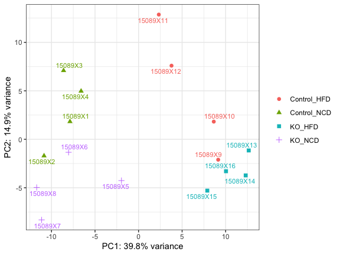
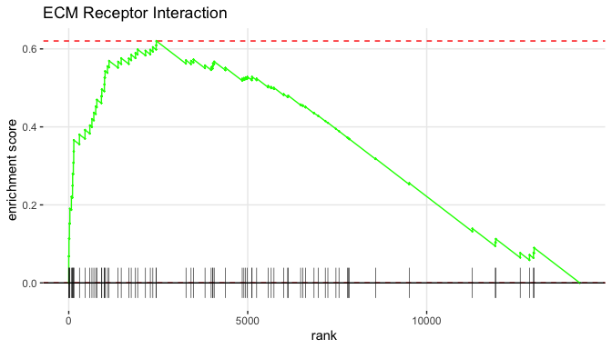

DESeq analysis of mouse liver samples
================
February 28, 2020

This guide follows the [Bioconductor RNA-Seq
workflow](http://master.bioconductor.org/packages/release/workflows/vignettes/rnaseqGene/inst/doc/rnaseqGene.html)
to find differentially expressed genes using
[DESeq2](http://www.bioconductor.org/packages/release/bioc/html/DESeq2.html)
version 1.26.0. For more details about the statistics, check the
original
[paper](https://genomebiology.biomedcentral.com/articles/10.1186/s13059-014-0550-8)
or online tutorials like the one from
[Harvard](https://hbctraining.github.io/DGE_workshop/lessons/04_DGE_DESeq2_analysis.html).

### Load samples and counts

Load the sample table with treatment and diet in the `extdata`
directory.

``` r
library(tidyverse)
extdata <- system.file("extdata", package="hciR")
samples <- read_tsv(paste(extdata, "liver_samples.tsv", sep="/"))
samples
#  # A tibble: 12 x 4
#     id       name      trt      diet 
#     <chr>    <chr>     <chr>    <chr>
#   1 15089X1  194-Liver Control  NCD  
#   2 15089X3  209-Liver Control  NCD  
#   3 15089X4  220-Liver Control  NCD  
#   4 15089X6  185-Liver Degs1_KO NCD  
#   5 15089X7  186-Liver Degs1_KO NCD  
#   6 15089X8  187-Liver Degs1_KO NCD  
#   7 15089X9  61-Liver  Control  HFD  
#   8 15089X10 70-Liver  Control  HFD  
#   9 15089X12 76-Liver  Control  HFD  
#  10 15089X13 82-Liver  Degs1_KO HFD  
#  11 15089X14 89-Liver  Degs1_KO HFD  
#  12 15089X16 92-Liver  Degs1_KO HFD
```

Load the combined
[featureCounts](http://bioinf.wehi.edu.au/featureCounts/) matrix.

``` r
counts <- read_tsv(paste(extdata, "liver_counts.tsv", sep="/"))
counts[, 1:8]
#  # A tibble: 53,801 x 8
#     geneid             `15089X1` `15089X3` `15089X4` `15089X6` `15089X7` `15089X8` `15089X9`
#     <chr>                  <dbl>     <dbl>     <dbl>     <dbl>     <dbl>     <dbl>     <dbl>
#   1 ENSMUSG00000000001      1941      2768      2910      2577      2265      2067      1517
#   2 ENSMUSG00000000003         0         0         0         0         1         0         0
#   3 ENSMUSG00000000028        21        27        27        28        17        18        21
#   4 ENSMUSG00000000031         3         1         5         3        10         0         3
#   5 ENSMUSG00000000037         0         0         0         0         4         0         0
#   6 ENSMUSG00000000049     28341     50511     49518     33501     31659     28992     36375
#   7 ENSMUSG00000000056       748      1665      1570      1002       694       907       811
#   8 ENSMUSG00000000058        53        94        75       110       121        88        32
#   9 ENSMUSG00000000078       249       200       355       180       221       218       190
#  10 ENSMUSG00000000085       102        93       121        77        90        96       110
#  # … with 53,791 more rows
```

Remove 18059 features with zero counts and 16304 features with 5 or
fewer reads in every sample to create a final count matrix with 19438
rows.

``` r
library(hciR)
counts <- filter_counts(counts, n=5)
#  Removed 18059 features with 0 reads
#  Removed 16304 features with <=5 maximum reads
```

Load the mouse annotations from Ensembl 92 in
[hciRdata](https://github.com/HuntsmanCancerInstitute/hciRdata) and
check genes with the highest number of assigned reads.

``` r
library(hciRdata)
n1 <- rowMeans(as_matrix(counts))
inner_join( dplyr::select(mouse92, 1:4,8),
 tibble(id= names(n1), mean_count = n1)) %>%
 mutate(description=substr(description, 1, 40)) %>%
 arrange(desc(mean_count))
#  Joining, by = "id"
#  # A tibble: 19,438 x 6
#     id                 gene_name biotype        chromosome description                               mean_count
#     <chr>              <chr>     <chr>          <chr>      <chr>                                          <dbl>
#   1 ENSMUSG00000029368 Alb       protein_coding 5          "Serum albumin"                             1203267.
#   2 ENSMUSG00000064339 mt-Rnr2   Mt_rRNA        MT         "mitochondrially encoded 16S rRNA"           446965.
#   3 ENSMUSG00000020609 Apob      protein_coding 12         "Apolipoprotein B-100 Apolipoprotein B-4…    383672.
#   4 ENSMUSG00000002985 Apoe      protein_coding 7          "Apolipoprotein E"                           282255.
#   5 ENSMUSG00000058207 Serpina3k protein_coding 12         "serine (or cysteine) peptidase inhibito…    208042.
#   6 ENSMUSG00000064351 mt-Co1    protein_coding MT         "mitochondrially encoded cytochrome c ox…    205715.
#   7 ENSMUSG00000037071 Scd1      protein_coding 19         "stearoyl-Coenzyme A desaturase 1"           161081 
#   8 ENSMUSG00000066154 Mup3      protein_coding 4          ""                                           129662.
#   9 ENSMUSG00000024164 C3        protein_coding 17         "Complement C3 Complement C3 beta chain …    127646.
#  10 ENSMUSG00000035540 Gc        protein_coding 5          "Vitamin D-binding protein"                  114648.
#  # … with 19,428 more rows
```

Following the DESeq2 vignette on
[interactions](http://bioconductor.org/packages/devel/bioc/vignettes/DESeq2/inst/doc/DESeq2.html#interactions),
there are a few ways to model the data.

1.  Combine trt and diet into a single column and select the pairwise
    comparisons of interest, for example Degs1-KO\_NCD vs Control\_NCD.
2.  Test interactions using ~ trt \* diet in the design formula
3.  Analyze a subset of samples like those from NCD. See the DEseq2
    [FAQ](http://bioconductor.org/packages/devel/bioc/vignettes/DESeq2/inst/doc/DESeq2.html#if-i-have-multiple-groups-should-i-run-all-together-or-split-into-pairs-of-groups)
    for more details on when to split the analysis into pairs of groups.

## Model 1, combine factors

Combine treatment and diet into a new column and order the factor
levels.

``` r
samples <- mutate(samples, trt_diet = gsub("Degs1_", "", paste(trt, diet, sep="_")))
samples$trt_diet <- factor(samples$trt_diet,
     levels = c("KO_HFD",  "KO_NCD", "Control_HFD", "Control_NCD"))
```

Run DESeq using the new trt\_diet column in the design formula and get
the regularized log (rlog) counts for sample visualizations. These
values are similar to the log2 normalized counts except the variance in
low count genes is reduced.

``` r
dds1 <- deseq_from_tibble(counts, samples, design = ~ trt_diet )
#  estimating size factors
#  estimating dispersions
#  gene-wise dispersion estimates
#  mean-dispersion relationship
#  final dispersion estimates
#  fitting model and testing
rld1 <-  r_log(dds1)
```

Plot the first two principal components using the rlog values from the
top 500 variable
genes.

``` r
# plot_pca(rld1, "trt_diet", tooltip=c("id", "name", "diet") , width=700)
plot_pca(rld1, "trt_diet", ggplot=TRUE, label="name")
```

<!-- -->

<br>

Cluster all the rlog values using the R function `dist` to calculate the
Euclidean distance between samples.

``` r
plot_dist(rld1, c("trt", "diet"), na_col="white")
```

<!-- -->

### Results

Run `check_contrasts` to list the pairwise comparisons.

``` r
data.frame(vs=check_contrasts(dds1$trt_diet))
#  6 contrasts:
#                             vs
#  1           KO_HFD vs. KO_NCD
#  2      KO_HFD vs. Control_HFD
#  3      KO_HFD vs. Control_NCD
#  4      KO_NCD vs. Control_HFD
#  5      KO_NCD vs. Control_NCD
#  6 Control_HFD vs. Control_NCD
```

Use the `subset` option to skip the 3rd and 4th contrasts and compare
the remaining rows using a 5% false discovery rate (FDR).

``` r
res <- results_all(dds1, mouse92, subset=c(1,2,5,6) )
#  Using adjusted p-value < 0.05
#  Adding shrunken fold changes to log2FoldChange
#  1. KO_HFD vs. KO_NCD:           1383 up and 1476 down regulated
#  2. KO_HFD vs. Control_HFD:      101 up and 79 down regulated
#  3. KO_NCD vs. Control_NCD:      87 up and 65 down regulated
#  4. Control_HFD vs. Control_NCD: 762 up and 470 down regulated
```

Plot fold changes and p-values from KO\_HFD vs. KO\_NCD in the first
contrast in a volcano plot.

``` r
plot_volcano(res[[1]], pvalue=10)
```

<!-- -->

<br>

Cluster the rlog values from all 2859 significant genes and scale by
rows, so values represent the number of standard deviations from the
mean rlog value.

``` r
x <- top_counts(res[[1]], rld1, top=3000)
nrow(x)
#  [1] 2859
plot_genes(x, c("trt", "diet"), scale ="row", annotation_names_col=FALSE,
 show_rownames=FALSE)
```

<!-- -->

Find genes in the PPAR Signaling Pathway using the MSigDB pathways in
[hciRdata](https://github.com/HuntsmanCancerInstitute/hciRdata). Note
the mouse annotations include human homologs from
MGI.

``` r
p1 <- filter(res[[1]], human_homolog %in% msig_pathways$KEGG[["PPAR Signaling Pathway"]])
dplyr::select(p1, 1:7,12)
#  # A tibble: 70 x 8
#     id        gene_name biotype   chromosome description                        human_homolog baseMean     padj
#     <chr>     <chr>     <chr>     <chr>      <chr>                              <chr>            <dbl>    <dbl>
#   1 ENSMUSG0… Pparg     protein_… 6          peroxisome proliferator activated… PPARG           252.   3.18e- 4
#   2 ENSMUSG0… Nr1h3     protein_… 2          Mus musculus nuclear receptor sub… NR1H3          1769.   8.98e- 1
#   3 ENSMUSG0… Ppard     protein_… 17         Peroxisome proliferator-activated… PPARD            55.0  9.57e- 1
#   4 ENSMUSG0… Angptl4   protein_… 17         Angiopoietin-related protein 4     ANGPTL4        1867.   7.58e- 3
#   5 ENSMUSG0… Cd36      protein_… 5          Platelet glycoprotein 4            CD36           2041.   7.27e-16
#   6 ENSMUSG0… Apoa2     protein_… 1          Apolipoprotein A-II Proapolipopro… APOA2         90023.   4.84e- 1
#   7 ENSMUSG0… Cpt1c     protein_… 7          Mus musculus carnitine palmitoylt… CPT1C             6.15 6.85e- 1
#   8 ENSMUSG0… Ubc       protein_… 5          ubiquitin C                        UBC             875.   1.02e- 3
#   9 ENSMUSG0… Acaa1b    protein_… 9          acetyl-Coenzyme A acyltransferase… ACAA1         12675.   4.12e- 1
#  10 ENSMUSG0… Lpl       protein_… 8          lipoprotein lipase                 LPL             664.   3.76e- 1
#  # … with 60 more rows
```

Cluster the PPAR genes in a heatmap. There are 70 expressed genes but
only 24 are significant, so add `filter=FALSE` to plot all genes since
`top_counts` will filter using an adjusted p-value \< 0.05 by default.

``` r
# x <- top_counts( p1, rld1, filter=FALSE)
x <- top_counts( p1, rld1)
plot_genes(x, c("trt", "diet"), fontsize_row=8, scale = "row")
```

<!-- -->

## Model 2, interaction model

Run `DESeq` using ~ trt \* diet in the design formula.

``` r
dds2 <- deseq_from_tibble(counts, samples, design = ~ trt * diet)
#  estimating size factors
#  estimating dispersions
#  gene-wise dispersion estimates
#  mean-dispersion relationship
#  final dispersion estimates
#  fitting model and testing
rld2 <- r_log(dds2)
```

Check if the treatment effect differs across diets using a 5% false
discovery rate (FDR). There are 98 signfiicant interactions.

``` r
DESeq2::resultsNames(dds2)
#  [1] "Intercept"               "trt_Degs1_KO_vs_Control" "diet_NCD_vs_HFD"         "trtDegs1_KO.dietNCD"
int <- DESeq2::results(dds2, name = "trtDegs1_KO.dietNCD", alpha = 0.05)
DESeq2::summary(int)
#  
#  out of 19438 with nonzero total read count
#  adjusted p-value < 0.05
#  LFC > 0 (up)       : 58, 0.3%
#  LFC < 0 (down)     : 40, 0.21%
#  outliers [1]       : 28, 0.14%
#  low counts [2]     : 9772, 50%
#  (mean count < 78)
#  [1] see 'cooksCutoff' argument of ?results
#  [2] see 'independentFiltering' argument of ?results
```

Add gene names and biotypes to the results.

``` r
int <- annotate_results(int, mouse92)
```

Create an interaction plot using the scaled rlog values from the top 25
genes sorted by adjusted p-value.

``` r
x <- top_counts( int, rld1, top=25)
plot_interactions(x, c( "diet", "trt"), ylab="Z-score") + theme_bw()
```

<!-- -->

### Save results

Save the DESeq and interaction results, raw counts, normalized counts,
regularized log counts and mouse annotations to a single Excel file in
`DESeq.xlsx` and R objects to a binary data file to load into a new
session.

``` r
res_all <- c(res, list(Interactions=int))
write_deseq(res_all, dds, rld, mouse92)
save(res, int, dds, rld, file="dds.rda")
```

## Pathway analysis

There are a number of options for pathway analysis and most can be
divided into one of two groups based on the input dataset. Gene set
enrichment methods like Broad’s
[GSEA](http://software.broadinstitute.org/gsea/index.jsp) require
**all** expressed genes sorted by fold change and calculate a running
sum statistic to find pathways that are enriched with either up- or
down-regulated genes.

Over representation methods require a smaller subset of significant
genes and use a Fisher’s test to identify significant pathways. There
are many online tools like [Enrichr](http://amp.pharm.mssm.edu/Enrichr/)
that accept a list of significant genes as input and return enriched
sets. To get a list of genes, just sort the DESeq results in the Excel
file by adjusted p-value and copy and paste the gene names into the
search box.

### GSEA

The
[fgsea](https://bioconductor.org/packages/release/bioc/html/fgsea.html)
package (fast gene set enrichment analysis) is similar to Broad’s GSEA
and finds pathways that are enriched with either up- or down-regulated
human genes. Load the KEGG pathways from
[MSigDB](http://software.broadinstitute.org/gsea/msigdb/collections.jsp)
and run `fgsea` using a 10% FDR.

``` r
set.seed(77)
k1 <- fgsea_all(res, msig_pathways$KEGG)
#  1. KO_HFD vs. KO_NCD:            38 enriched sets (17 positive, 21 negative)
#  2. KO_HFD vs. Control_HFD:       84 enriched sets (54 positive, 30 negative)
#  3. KO_NCD vs. Control_NCD:       33 enriched sets (4 positive, 29 negative)
#  4. Control_HFD vs. Control_NCD:  39 enriched sets (0 positive, 39 negative)
```

Print the top pathways from KO\_HFD vs. KO\_NCD and check the GSEA [user
guide](http://software.broadinstitute.org/gsea/doc/GSEAUserGuideFrame.html)
for details about the statistics.

``` r
group_by(k1[[1]][, -8], enriched) %>% top_n(4, abs(NES)) %>% ungroup()
#  # A tibble: 8 x 8
#    pathway                                          pval    padj     ES   NES nMoreExtreme  size enriched
#    <chr>                                           <dbl>   <dbl>  <dbl> <dbl>        <dbl> <int> <chr>   
#  1 Ribosome                                     0.000291 0.00413 -0.869 -3.78            0    82 negative
#  2 Spliceosome                                  0.000311 0.00413 -0.488 -2.29            0   122 negative
#  3 Oxidative Phosphorylation                    0.000301 0.00413 -0.497 -2.26            0   103 negative
#  4 Parkinsons Disease                           0.000301 0.00413 -0.471 -2.13            0    99 negative
#  5 ECM Receptor Interaction                     0.000156 0.00413  0.545  2.10            0    67 positive
#  6 Primary Immunodeficiency                     0.000170 0.00413  0.669  2.09            0    25 positive
#  7 Intestinal Immune Network for IGA Production 0.000168 0.00413  0.652  2.09            0    28 positive
#  8 Chemokine Signaling Pathway                  0.000144 0.00413  0.449  1.95            0   142 positive
```

Get the fold change vector and create an enrichment plot for Ribosome.

``` r
library(fgsea)
fc <- write_gsea_rnk(res, write=FALSE)
head(fc[[1]])
#   CNTNAP1     CD36   TTC39A   LGALS1   PNLDC1    PLIN4 
#  2.030035 1.985832 1.983363 1.905122 1.876408 1.839541
plotEnrichment(msig_pathways$KEGG[["Ribosome"]],  fc[[1]]) +
ggplot2::labs(title="Ribosome")
```

<!-- -->

Compare to ECM Receptor Interaction with mostly up-regulated
genes.

``` r
plotEnrichment(msig_pathways$KEGG[["ECM Receptor Interaction"]],  fc[[1]]) +
ggplot2::labs(title="ECM Receptor Interaction")
```

<!-- -->

Plot NES scores from significant pathways in two or more contrasts.

``` r
plot_fgsea(k1, fontsize_row=7, sets =2)
#  57 total sets
```

<!-- -->

Save the enriched pathways to an Excel file.

``` r
openxlsx::write.xlsx(k1, file = "KEGG_pathways.xlsx")
```

<br>

The genes from
[MSigDB](http://software.broadinstitute.org/gsea/msigdb/collections.jsp)
are saved as a list of vectors and include hallmark, pathways, go,
motifs, cancer, immunologic and oncogenic sets.

``` r
lapply(msig_hallmark[1:3], head, 7)
#  $`Tnfa Signaling Via Nfkb`
#  [1] "ABCA1"      "AC129492.1" "ACKR3"      "AREG"       "ATF3"       "ATP2B1"     "B4GALT1"   
#  
#  $Hypoxia
#  [1] "ACKR3"   "ADM"     "ADORA2B" "AK4"     "AKAP12"  "ALDOA"   "ALDOB"  
#  
#  $`Cholesterol Homeostasis`
#  [1] "ABCA2" "ACAT2" "ACSS2" "ACTG1" "ADH4"  "ALCAM" "ALDOC"
```

Four datasets are a list of lists and include two or more groups, so
select a list element like `msig_pathways$REACTOME` to return the sets.

``` r
names(msig_pathways)
#  [1] "BIOCARTA" "KEGG"     "NABA"     "PID"      "REACTOME" "SA"       "SIG"      "WNT"
names(msig_go)
#  [1] "BP" "MF" "CC"
names(msig_motifs)
#  [1] "TFT" "MIR"
names(msig_cancer)
#  [1] "CAR"    "GCM"    "GNF2"   "MODULE" "MORF"
```

<br>
