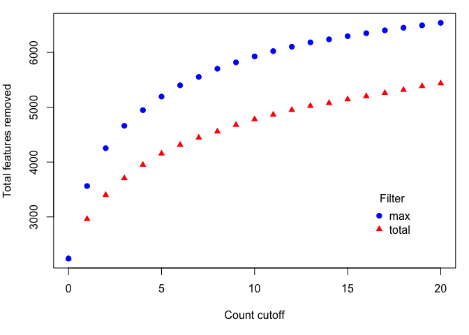
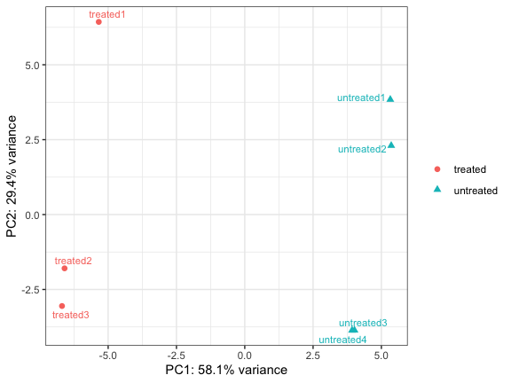
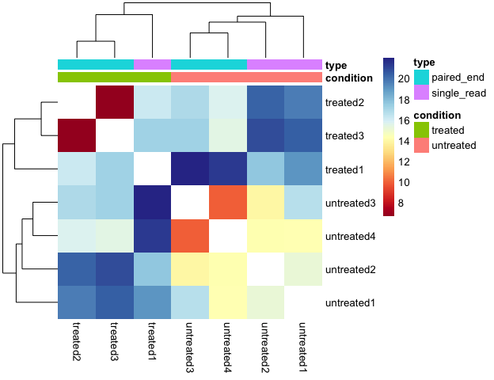
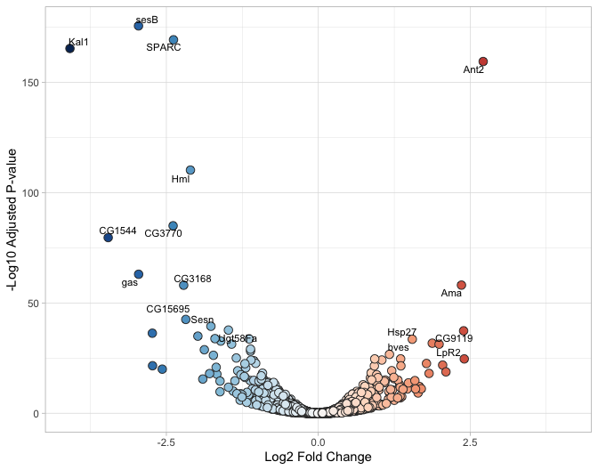
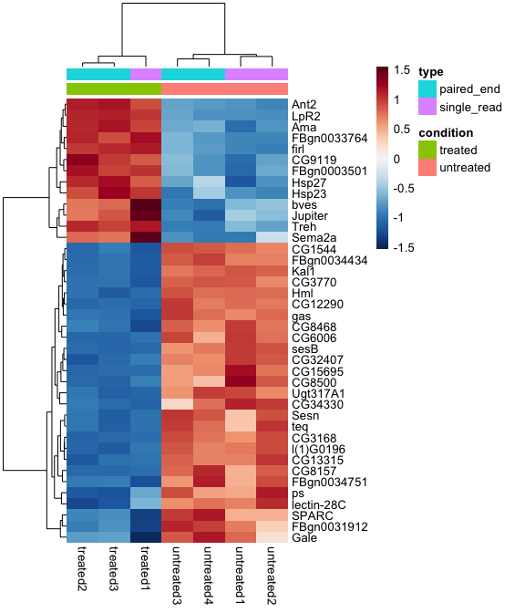
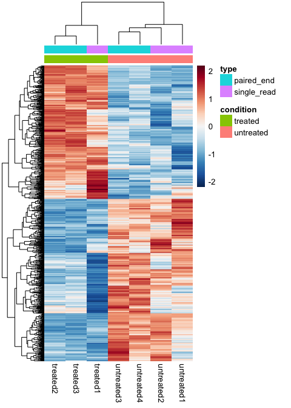

DESeq analysis of Pasilla knock-downs
================
October 18, 2019

This guide follows the [Bioconductor RNA-Seq
workflow](http://master.bioconductor.org/packages/release/workflows/vignettes/rnaseqGene/inst/doc/rnaseqGene.html)
to find differentially expressed genes using
[DESeq2](http://www.bioconductor.org/packages/release/bioc/html/DESeq2.html)
version 1.24.0. The
[hciR](https://github.com/HuntsmanCancerInstitute/hciR) package works
best with [tidyverse](http://tidyverse.org/) packages (readr, dplyr,
tibble, etc.) and simplifies the code in a typical differential
expression analysis.

### Load samples and counts

Load the sample table from the
[pasilla](http://bioconductor.org/packages/release/data/experiment/html/pasilla.html)
package using the [readr](http://readr.tidyverse.org/) package. A copy
of these files are also available in `extdata` directory in the
[hciR](https://github.com/HuntsmanCancerInstitute/hciR) package.

``` r
library(tidyverse)
extdata <- system.file("extdata", package="hciR")
samples <- read_tsv(paste(extdata, "pasilla_samples.tsv", sep="/"))
samples
#  # A tibble: 7 x 6
#    file       condition type        lanes reads            exons
#    <chr>      <chr>     <chr>       <dbl> <chr>            <dbl>
#  1 treated1   treated   single_read     5 35158667      15679615
#  2 treated2   treated   paired_end      2 12242535 (x2) 15620018
#  3 treated3   treated   paired_end      2 12443664 (x2) 12733865
#  4 untreated1 untreated single_read     2 17812866      14924838
#  5 untreated2 untreated single_read     6 34284521      20764558
#  6 untreated3 untreated paired_end      2 10542625 (x2) 10283129
#  7 untreated4 untreated paired_end      2 12214974 (x2) 11653031
```

Load the count table. The sample names in the first column above should
match the count column names (the same order is not required).

``` r
counts  <- read_tsv(paste(extdata, "pasilla_counts.tsv", sep="/"))
counts
#  # A tibble: 14,599 x 8
#     id          untreated1 untreated2 untreated3 untreated4 treated1 treated2 treated3
#     <chr>            <dbl>      <dbl>      <dbl>      <dbl>    <dbl>    <dbl>    <dbl>
#   1 FBgn0000003          0          0          0          0        0        0        1
#   2 FBgn0000008         92        161         76         70      140       88       70
#   3 FBgn0000014          5          1          0          0        4        0        0
#   4 FBgn0000015          0          2          1          2        1        0        0
#   5 FBgn0000017       4664       8714       3564       3150     6205     3072     3334
#   6 FBgn0000018        583        761        245        310      722      299      308
#   7 FBgn0000022          0          1          0          0        0        0        0
#   8 FBgn0000024         10         11          3          3       10        7        5
#   9 FBgn0000028          0          1          0          0        0        1        1
#  10 FBgn0000032       1446       1713        615        672     1698      696      757
#  # … with 14,589 more rows
```

Check the pre-filter count cutoffs. The plot displays the number of
reads removed using either a maximum based filter or the total number of
reads.

``` r
library(hciR)
plot_filter(counts)
```

<!-- -->

Remove 2240 features with zero counts and 2954 with five or fewer reads
in every sample to create a final matrix with 9405 rows.

``` r
counts <- filter_counts(counts, n = 5)
#  Removed 2240 features with 0 reads
#  Removed 2954 features with <=5 maximum reads
```

### Load annotations

The [hciRdata](https://github.com/HuntsmanCancerInstitute/hciRdata)
package includes the latest Ensembl annotations for twelve common
reference genomes (version 98).

``` r
library(hciRdata)
dplyr::select(fly98, 1:4,8)
#  # A tibble: 17,753 x 5
#     id          gene_name      biotype        chromosome description                                
#     <chr>       <chr>          <chr>          <chr>      <chr>                                      
#   1 FBgn0000003 7SLRNA:CR32864 ncRNA          3R         Signal recognition particle 7SL RNA CR32864
#   2 FBgn0000008 a              protein_coding 2R         arc                                        
#   3 FBgn0000014 abd-A          protein_coding 3R         abdominal A                                
#   4 FBgn0000015 Abd-B          protein_coding 3R         Abdominal B                                
#   5 FBgn0000017 Abl            protein_coding 3L         Abl tyrosine kinase                        
#   6 FBgn0000018 abo            protein_coding 2L         abnormal oocyte                            
#   7 FBgn0000022 ac             protein_coding X          achaete                                    
#   8 FBgn0000024 Ace            protein_coding 3R         Acetylcholine esterase                     
#   9 FBgn0000028 acj6           protein_coding X          abnormal chemosensory jump 6               
#  10 FBgn0000032 Acph-1         protein_coding 3R         Acid phosphatase 1                         
#  # … with 17,743 more rows
```

The
[pasilla](http://bioconductor.org/packages/release/data/experiment/html/pasilla.html)
dataset was analyzed using Ensembl version 62, so 708 gene ids have been
removed from the latest release. See the
[Ensembl](https://github.com/HuntsmanCancerInstitute/hciR/vignettes/Ensembl.md)
vignette to download an earlier release.

``` r
filter(counts, !id %in% fly98$id) %>% nrow()
#  [1] 708
```

Check genes with the highest number of assigned reads.

``` r
n1 <- rowMeans(as_matrix(counts))
right_join( dplyr::select(fly98, 1:4,8),
 tibble(id= names(n1), mean_count = n1)) %>%
 arrange(desc(mean_count))
#  Joining, by = "id"
#  # A tibble: 9,405 x 6
#     id          gene_name biotype        chromosome description                                mean_count
#     <chr>       <chr>     <chr>          <chr>      <chr>                                           <dbl>
#   1 FBgn0000556 <NA>      <NA>           <NA>       <NA>                                          207838.
#   2 FBgn0000559 eEF2      protein_coding 2L         eukaryotic translation elongation factor 2    113005.
#   3 FBgn0064225 RpL5      protein_coding 2L         Ribosomal protein L5                          109428.
#   4 FBgn0003517 sta       protein_coding X          stubarista                                     92083.
#   5 FBgn0002526 LanA      protein_coding 3L         Laminin A                                      90414.
#   6 FBgn0001219 <NA>      <NA>           <NA>       <NA>                                           88658.
#   7 FBgn0000042 Act5C     protein_coding X          Actin 5C                                       86791.
#   8 FBgn0039713 RpS8      protein_coding 3R         Ribosomal protein S8                           81631 
#   9 FBgn0027571 <NA>      <NA>           <NA>       <NA>                                           74067.
#  10 FBgn0026372 RpL23A    protein_coding 3L         Ribosomal protein L23A                         64875 
#  # … with 9,395 more rows
```

### Run DESeq

Run `DESeq` using ~ condition + type in the design formula to control
for paired vs single end effects on gene expression and get the
regularized log (rlog) counts for sample visualizations. These values
are similar to the log2 normalized counts except the variance in low
count genes is reduced.

``` r
dds <- deseq_from_tibble(counts, samples,  design = ~ condition + type)
#  Reordering columns in counts to match samples
#  estimating size factors
#  estimating dispersions
#  gene-wise dispersion estimates
#  mean-dispersion relationship
#  final dispersion estimates
#  fitting model and testing
rld <- DESeq2::rlog(dds)
```

Plot the first two principal components using the rlog values from the
top 500 variable genes. The `plot_pca` function will plot an interactive
[highchart](http://jkunst.com/highcharter/index.html) by default.

``` r
# plot_pca(rld, "condition", tooltip=c("file", "type") , width=700)
plot_pca(rld, "condition", label="file", ggplot=TRUE)
```

<!-- -->

<br>

Cluster all the rlog values using the R function `dist` to calculate the
Euclidean distance between samples. Since the distance values on the
diagonal are always zero, this is set to NA to avoid skewing the heatmap
colors.

``` r
# plot_dist(rld , c("condition", "type"), palette="Blues", diagNA=FALSE, reverse=TRUE)
plot_dist(rld , c("condition", "type"), na_col="white")
```

<!-- -->

### Results

The `results_all` function will run ***all*** pairwise comparisons in
alphabetical order (A vs B, A vs C and B vs C). Use `check_contrasts` to
list the contrasts.

``` r
check_contrasts(dds$condition)
#  1 contrasts:
#  [1] "treated vs. untreated"
```

The control group should be the reference level and listed second. If
you need to reorder the groups, use `factor` to set the factor levels
***before*** running `DESeq` above. For example, if you have a `trt`
column with KO and control groups, set the factor levels so the control
group is listed last. Note the standard DESeq2 workflow typically wants
the control group listed first.

``` r
samples$trt <- factor(samples$trt, levels = c( "KO", "control"))
```

Compare treated vs. untreated using a 5% FDR and add gene annotations to
the result tables.

``` r
res <- results_all(dds, fly98, alpha= 0.05)
#  Using adjusted p-value < 0.05
#  Adding shrunken fold changes to log2FoldChange
#  1. treated vs. untreated: 492 up and 598 down regulated
#  Note: 708 rows in results are missing from biomart table
```

The results are a tibble or list of tibbles if there is more than one
contrast.

``` r
arrange(res, padj)  %>%
  dplyr::select(1:7,11)
#  # A tibble: 9,405 x 8
#     id        gene_name biotype      chromosome description                   baseMean log2FoldChange      padj
#     <chr>     <chr>     <chr>        <chr>      <chr>                            <dbl>          <dbl>     <dbl>
#   1 FBgn0003… sesB      protein_cod… X          stress-sensitive B               4342.          -2.96 2.13e-176
#   2 FBgn0026… SPARC     protein_cod… 3R         Secreted protein, acidic, cy…   43914.          -2.38 4.34e-170
#   3 FBgn0039… Kal1      protein_cod… 3R         Kallmann syndrome 1               730.          -4.09 3.74e-166
#   4 FBgn0025… Ant2      protein_cod… X          Adenine nucleotide transloca…    1501.           2.71 3.06e-160
#   5 FBgn0029… Hml       protein_cod… 3L         Hemolectin                       3706.          -2.10 5.31e-111
#   6 FBgn0035… CG3770    protein_cod… 2R         <NA>                              638.          -2.39 9.53e- 86
#   7 FBgn0039… CG1544    protein_cod… 3R         <NA>                              262.          -3.46 2.15e- 80
#   8 FBgn0034… gas       protein_cod… 2R         gasoline                          226.          -2.96 9.24e- 64
#   9 FBgn0000… Ama       protein_cod… 3R         Amalgam                           342.           2.36 7.82e- 59
#  10 FBgn0029… CG3168    protein_cod… X          <NA>                              490.          -2.22 8.59e- 59
#  # … with 9,395 more rows
```

Plot the fold changes and p-values in a volcano plot.

``` r
plot_volcano(res, pvalue= c(35,25))
```

<!-- -->

Cluster the top 40 significant genes and scale by rows, so values
represent the number of standard deviations from the mean rlog value.

``` r
x <- top_counts( res, rld, top=40)
x
#  # A tibble: 40 x 8
#     id     treated1 treated2 treated3 untreated1 untreated2 untreated3 untreated4
#     <chr>     <dbl>    <dbl>    <dbl>      <dbl>      <dbl>      <dbl>      <dbl>
#   1 sesB      10.5     10.6     10.5       12.5       12.4       12.2       12.2 
#   2 SPARC     14.0     14.4     14.4       15.4       15.4       15.8       16.0 
#   3 Kal1       7.48     7.64     7.69       9.79       9.71       9.62       9.71
#   4 Ant2      10.8     11.0     11.1        9.28       9.22       9.35       9.31
#   5 Hml       10.9     10.9     10.8       12.1       12.1       12.2       12.1 
#   6 CG3770     8.15     8.28     8.28       9.60       9.46       9.57       9.61
#   7 CG1544     6.53     6.63     6.75       8.18       8.10       8.30       8.27
#   8 gas        6.55     6.70     6.69       7.90       8.00       8.14       7.98
#   9 Ama        8.70     8.80     8.86       7.26       7.43       7.52       7.55
#  10 CG3168     7.97     7.91     7.94       9.04       9.25       9.25       9.13
#  # … with 30 more rows
plot_genes(x, c("condition", "type"), scale ="row", annotation_names_col=FALSE)
```

<!-- -->

Cluster all 1090 significant genes.

``` r
x <- top_counts(res, rld, top=2000)
nrow(x)
#  [1] 1090
plot_genes(x, c("condition", "type"), scale ="row", annotation_names_col=FALSE,
 show_rownames=FALSE)
```

<!-- -->

### Save results

Save the DESeq results, raw counts, normalized counts, regularized log
counts and fly annotations to a single Excel file in `DESeq.xlsx` and R
objects to a binary data file to load into a new session.

``` r
write_deseq(res, dds, rld, fly98)
save(res, dds, rld, file="dds.rda")
```

The pasilla dataset is also available in the `hciR` package and used in
the help examples.

``` r
pasilla <- list(dds = dds, rlog = rld, results = res)
```

<br>
